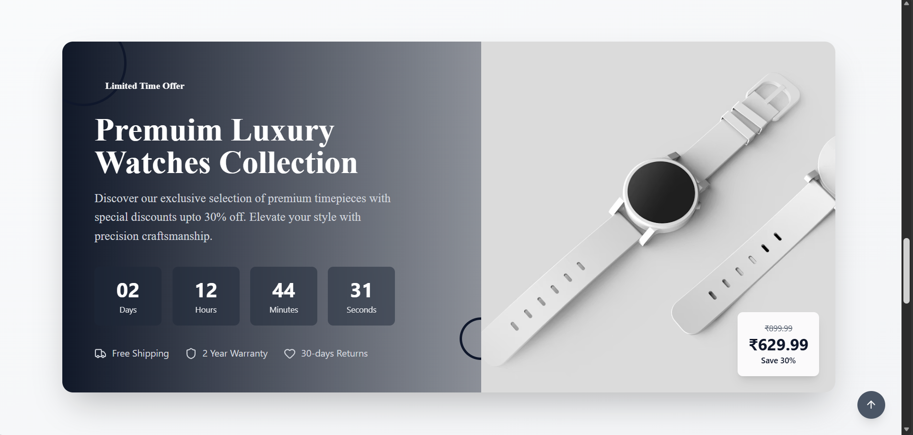
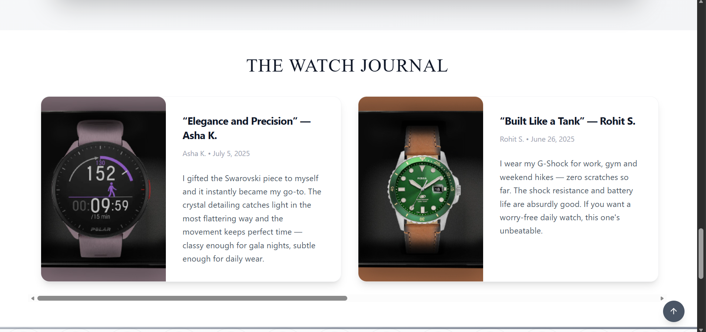
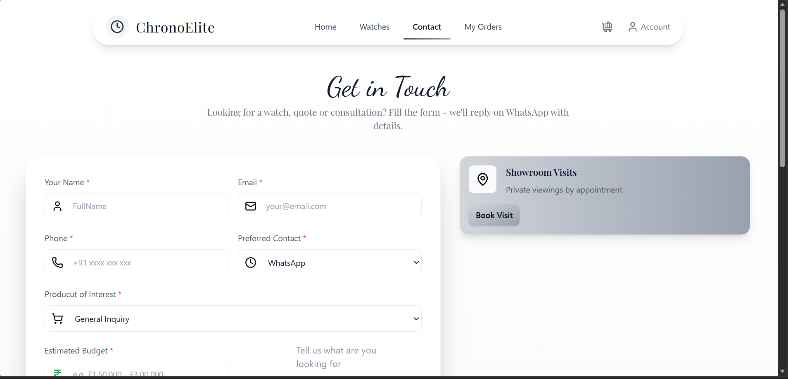
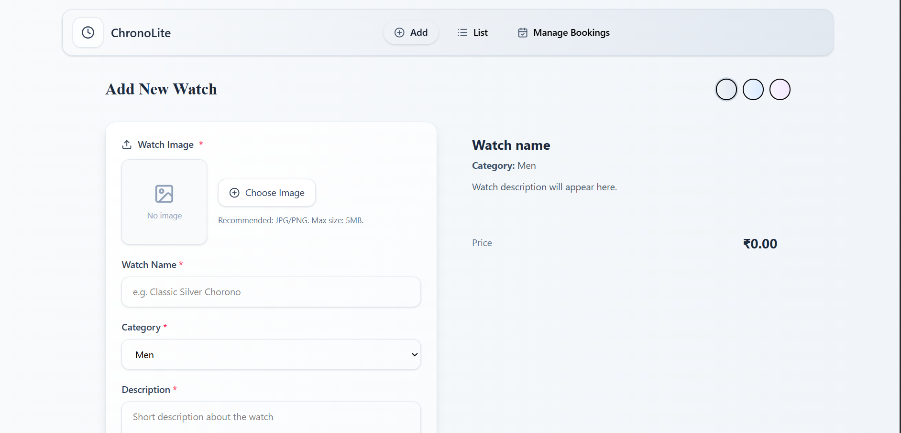
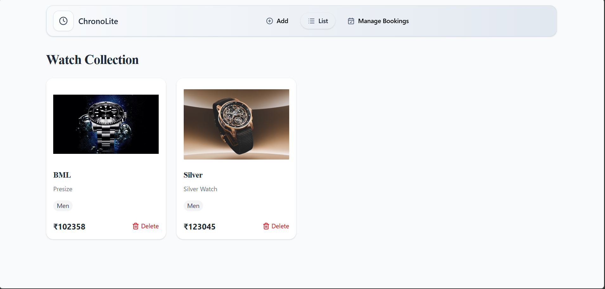
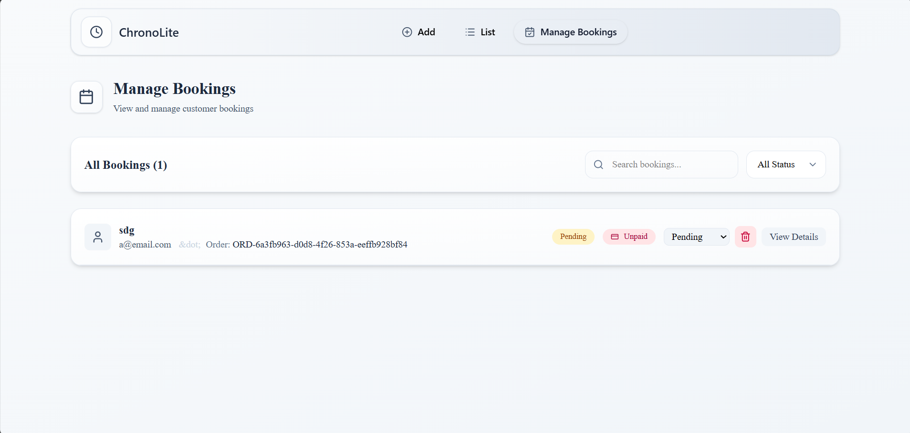

# ⌚ Watch E-Commerce Site

A full-stack luxury watch e-commerce platform built with **React**, **Node.js**, **Express**, and **MongoDB**.

---

## 🖼️ Screenshots

### Home Page






### Watches & Contact



### Admin Panel




---

## 🚀 Features

- 🛍️ Browse luxury watches by brand and category
- 🔍 Filter watches by type
- 🛒 Add to cart with quantity controls
- 👤 User authentication (Register / Login) with JWT
- 📦 Place orders with delivery details
- 💳 Online payment via **Stripe** or **Cash on Delivery**
- 📋 View and cancel your orders
- 🖼️ Admin panel to add, list, and manage watches
- 📬 Contact page
- 📱 Fully responsive design

---

## 🛠️ Tech Stack

| Layer     | Technology                          |
|-----------|--------------------------------------|
| Frontend  | React, Vite, Tailwind CSS, Axios     |
| Backend   | Node.js, Express.js                  |
| Database  | MongoDB, Mongoose                    |
| Auth      | JWT (JSON Web Tokens), bcryptjs      |
| Payments  | Stripe                               |
| Images    | Multer (local file upload)           |

---

## 📁 Project Structure

```
WatchSite/
├── frontend/       # React app (user-facing store)
├── admin/          # React app (admin dashboard)
└── backend/        # Express API server
```

---

## ⚙️ Getting Started

### Prerequisites
- Node.js
- MongoDB (local or Atlas)
- Stripe account (for online payments)

### 1. Clone the repo
```bash
git clone https://github.com/Kill826/Watch-E-Commerce-site.git
cd Watch-E-Commerce-site
```

### 2. Setup Backend
```bash
cd backend
npm install
```

Create a `.env` file in the `backend/` folder:
```env
MONGO_URI=your_mongodb_connection_string
STRIPE_SECRET_KEY=your_stripe_secret_key
JWT_SECRET=your_jwt_secret
FRONTEND_URL=http://localhost:5173/
```

Start the backend:
```bash
npm start
```

### 3. Setup Frontend
```bash
cd frontend
npm install
npm run dev
```

### 4. Setup Admin Panel
```bash
cd admin
npm install
npm run dev
```

---

## 🌐 API Endpoints

| Method | Endpoint              | Description              |
|--------|-----------------------|--------------------------|
| POST   | /api/auth/register    | Register a new user      |
| POST   | /api/auth/login       | Login and get JWT token  |
| GET    | /api/watches          | Get all watches          |
| POST   | /api/watches          | Add a new watch (admin)  |
| GET    | /api/cart             | Get user's cart          |
| POST   | /api/cart/add         | Add item to cart         |
| PUT    | /api/cart/update      | Update cart item qty     |
| DELETE | /api/cart/remove/:id  | Remove item from cart    |
| POST   | /api/orders           | Place an order           |
| GET    | /api/orders/my        | Get logged-in user orders|

---

## 🔐 Environment Variables

> ⚠️ Never commit your `.env` file. It is already added to `.gitignore`.

| Variable           | Description                        |
|--------------------|------------------------------------|
| MONGO_URI          | MongoDB connection string          |
| STRIPE_SECRET_KEY  | Stripe secret key                  |
| JWT_SECRET         | Secret key for signing JWT tokens  |
| FRONTEND_URL       | Frontend URL for Stripe redirects  |

---

## 👤 Author

**Kill826** — [GitHub Profile](https://github.com/Kill826)
